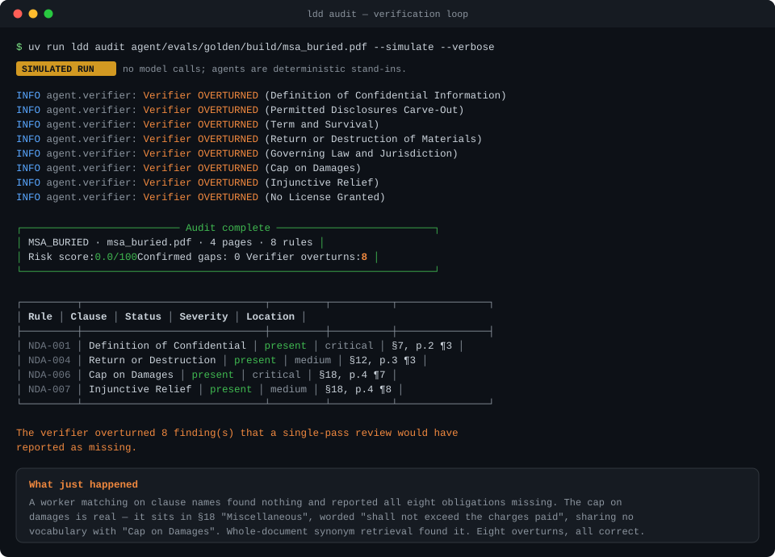
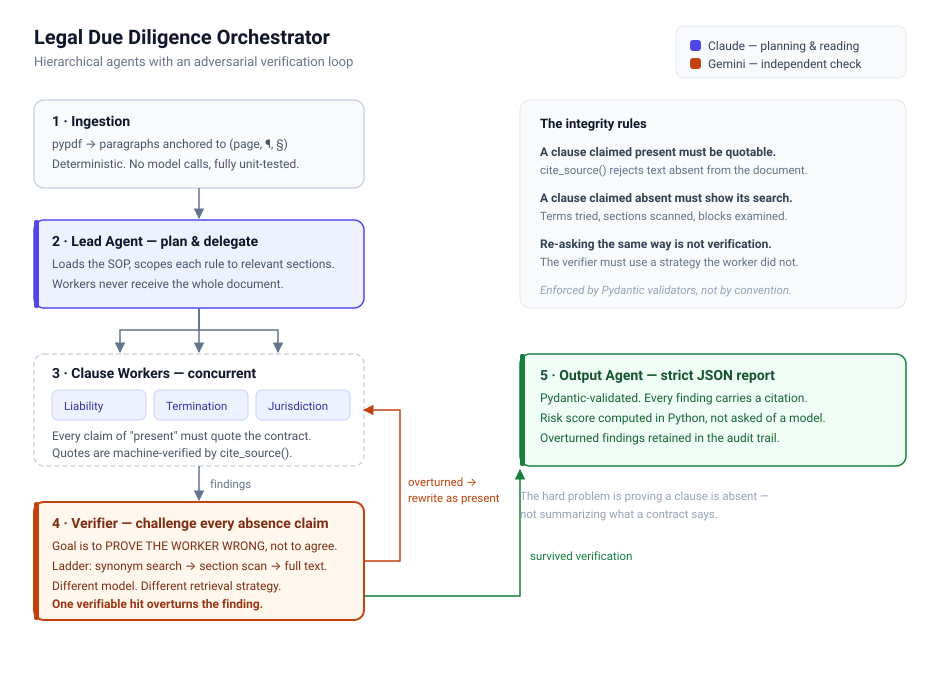

## Legal Due Diligence Orchestrator
An Agentic AI system that operates as an autonomous legal due diligence orchestrator. Unlike linear automations, this multi-agent architecture utilizes an adversarial reasoning loop to audit complex contracts, make independent decisions about compliance risks, and use tools to securely parse documents, verify absence claims, and generate deterministic risk reports.

Instead of manually skimming hundreds of pages to prove what an agreement doesn't say, this system gives AI agents access to your legal documents and compliance rulebooks, allowing them to execute your firm's Standard Operating Procedures (SOPs) autonomously while actively preventing "lazy LLM" false negatives.

---

## Why This Matters:
* **Eliminates False Negatives:** Prevents the most dangerous failure mode in AI contract review—quietly missing missing clauses.
* **Reduces Paralegal Load:** Automates the tedious "absence-checking" phase of legal due diligence.
* **Auditable & Deterministic:** Every AI decision is backed by schema-enforced citations and deterministic Python scoring.

---

## The problem

Contract review tools are good at telling you what a document **says**. The expensive
paralegal work is proving what a document **doesn't** say — that there's no cap on
damages, no governing-law clause, no return-of-materials obligation.

That's also where language models fail hardest, and fail *quietly*. A model that skims
a 90-page master services agreement and reports *"no limitation of liability found"*
produces output identical to a model that looked carefully and found nothing. Nothing
in the response distinguishes diligence from laziness — and in legal work that false
negative is the difference between a clean deal and uncapped exposure.

**So this system treats absence claims as untrusted by default.** Any agent that
reports a missing clause triggers a verifier that re-reads the document with a
deliberately *different* retrieval strategy, on a *different* model, with the burden
of proof inverted — before the finding is allowed into the report.

## Backend Demonstration



Try it out! (no API key required):

```bash
uv run ldd audit agent/evals/golden/build/msa_buried.pdf --simulate --verbose

```

## Interface Demonstration (Click for better visual experience)

| [Interactive walkthrough](https://rhain-r.github.io/legal-due-diligence-orchestrator/) | A guided walkthrough |
| --- | ---|
---

## Architecture



<details>
<summary>Text version</summary>

```
[ Ingestion ]  pypdf → paragraphs anchored to (page, ¶, §)
      │
      ▼
[ Lead Agent ]  loads SOP, scopes each rule to relevant sections
      │
      ├──► [ Liability Worker ]     ──► "uncapped risk"
      ├──► [ Termination Worker ]   ──► "clause missing"
      ├──► [ Jurisdiction Worker ]  ──► "found, §8"
      │
      ▼
[ Verifier ]  synonym search → section scan → full text
      │        goal: PROVE THE WORKER WRONG
      ├──► one verifiable hit ⇒ finding overturned
      │
      ▼
[ Output Agent ]  Pydantic-validated JSON + risk score
```

</details>

---

## Challenges Solved

* **The "Lazy LLM" Problem:** A model skimming a 90-page MSA will often say "no clause found" just to save compute. 
  * *Solution:* **Adversarial Verification.** The verifier is forced to use a different retrieval strategy (synonym search + section scans) and a different model (Gemini vs. Claude), with the burden of proof inverted.
 <br></br>
* **Hallucinated Quotes:** LLMs notoriously invent text that sounds legally plausible.
  * *Solution:* **Citation Gates.** A custom `cite_source()` function verifies quotes against the anchored `(page, ¶, §)` source text before minting a Citation object.
<br></br>
* **Self-Contradictory JSON:** Agents often output a status of "MISSING" while providing a quote of the clause.
  * *Solution:* **Schema-Enforced Integrity.** Pydantic v2 with `extra="forbid"` throws a `ValidationError` if an agent submits logically impossible combinations.
<br></br>

---

## Repository layout

```
agent/
├── schemas.py         message contracts — the architecture lives here
├── config.py          models, keys, limits; nothing hardcoded elsewhere
├── llm.py             provider adapters + structured output with retry
├── orchestrator.py    plan → dispatch → route → trace
├── workers.py         one clause domain each
├── verifier.py        the adversarial loop
├── reporter.py        scoring, JSON, terminal, markdown
├── sop.py             YAML rule loading
├── ingestion/         PDF → anchored blocks → chunks   (no LLM calls)
├── tools/             cite_source(), retrieval strategies (no LLM calls)
├── prompts/           system prompts, on disk so they show up in diffs
├── rules/             compliance SOPs as YAML
├── evals/             golden contracts, answer keys, scoring harness
└── tests/             85 tests, all against stubbed clients
assets/                architecture diagram
docs/                  architecture · compliance-rules · setup-guide · build-plan
```

---

## Evaluation

Six synthetic contracts, 48 rule checks, each with a YAML answer key recording which
obligations are genuinely present and which were deliberately removed. The set
includes the two traps that matter: clauses **present but renamed**, and clauses that
**look present but are negated by their own wording**.

```bash
uv run python -m agent.evals.run
```

> **What these numbers are.** No API keys were used. The agents are deterministic
> lexical stand-ins, so this measures **pipeline recovery behaviour** — the retrieval
> ladder, citation gate, and verdict routing, all real code — and **not** model
> accuracy. Swapping in Claude and Gemini would produce different numbers, and those
> would be the ones worth quoting about models. The stand-ins never read an answer key.

Positive class is an absence claim, so a false positive is *"we told the client their
cap on damages is missing when it wasn't"*.

| Worker | | Precision | Recall | F1 | FP | FN |
| --- | --- | --- | --- | --- | --- | --- |
| Keyword-blind | workers only | 0.222 | 0.667 | 0.333 | 21 | 3 |
| Keyword-blind | **+ verification** | **0.462** | **0.667** | **0.546** | **7** | **3** |
| Synonym-aware | workers only | 0.417 | 0.556 | 0.477 | 7 | 4 |
| Synonym-aware | + verification | 0.417 | 0.556 | 0.477 | 7 | 4 |

**21 overturns, 21 correct, 0 incorrect.** The verifier never once rescued a gap that
was genuinely there — the failure mode that would make verification worse than useless.

### What the evaluation actually found

**1. Verifier lift is inversely proportional to synonym quality.** Against a
keyword-blind worker it eliminated 14 of 21 false absence claims. Against a
synonym-aware worker it eliminated **zero**, because the worker had already caught
them. Actionable conclusion: *invest in the SOP's synonym lists first.* Verification
is the safety net for what synonyms miss, not a substitute for writing them well.

**2. All 7 remaining false positives are on one contract** — the one whose every
clause is renamed ("Protected Material" for Confidential Information, "Applicable
Regime" for Governing Law). A lexical verifier cannot bridge that gap. **This is
precisely the work a real model does**, and it's the clearest evidence here of where
the simulation's ceiling sits.

**3. Every false negative is a false-*presence* claim the verifier never saw.**
By design it challenges absence claims only, so a worker that confidently matches a
reassuring heading — over a clause that negates itself — is never contradicted. That
is the architecture's real structural blind spot, and it now has a number on it.
Symmetric verification of presence claims is the highest-value next change.

Raw results: [`agent/evals/results/`](agent/evals/results/).

---

## Tech stack

| Component | Choice | Why |
| --- | --- | --- |
| Reasoning | Anthropic Claude Sonnet | Planner and clause workers |
| Verification | Google Gemini | Different lab, so the cross-check is real |
| Parsing | `pypdf` | Actively maintained, unlike PyPDF2 |
| Validation | Pydantic v2 | `extra="forbid"` everywhere |
| Orchestration | Purpose-built `asyncio` | See below |
| Tooling | `uv`, `pytest`, `ruff`, `typer`, `rich` | |
| Built with | Claude Code | See [build plan](docs/build-plan.md) |

## Documentation

| Doc | Contents |
| --- | --- |
| [architecture.md](docs/architecture.md) | Component map, audit sequence, verification design, limitations |
| [compliance-rules.md](docs/compliance-rules.md) | YAML rule format and how to author good synonyms |
| [setup-guide.md](docs/setup-guide.md) | Install, configure, run, troubleshoot |
| [build-plan.md](docs/build-plan.md) | Phase-by-phase build log and remaining work |


